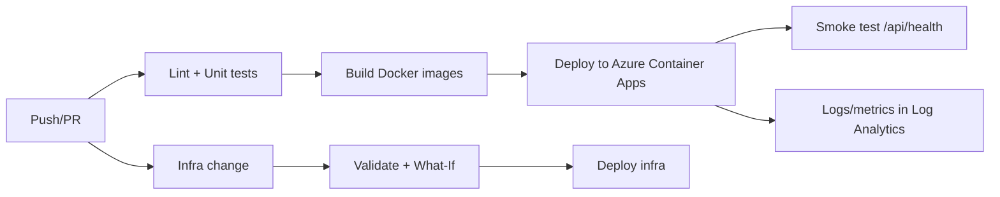

# DevOps Pulse (Demo Web App)

A tiny **two-tier web app** you can use to demonstrate a CI/CD pipeline:

- **Frontend**: SvelteKit UI
- **Backend**: Node.js/Express REST API
- **Database**: MongoDB (local via Docker Compose) or MongoDB Atlas/Cosmos (Mongo API) in the cloud

The app is intentionally simple: it shows API health and lets you add/view *Deployment Notes*.

## Local quick start (Docker Compose)

```bash
docker compose up --build
```

- Frontend: http://localhost:5173
- Backend API: http://localhost:3000/api/health

## CI/CD + IaC (Azure starter)

This repo includes:
- `.github/workflows/infra.yml` (Bicep validate/what-if/deploy)
- `.github/workflows/ci.yml` (lint/test + build/deploy to Azure Container Apps)
- `infra/main.bicep` (Container Apps environment + ACR + two Container Apps)

You must set GitHub secrets/variables described in `docs/AZURE_SETUP.md`.

## Mermaid diagram


